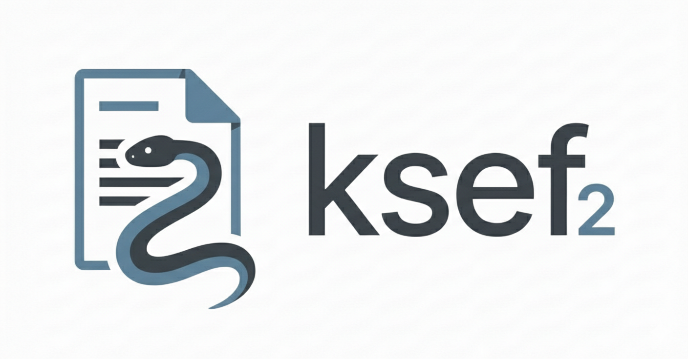

<div align="center">
<a href="https://github.com/artpods56/KUL_Notarius" title="TrendRadar">
  
</a>

**Python SDK and Tools for Poland's KSeF (Krajowy System e-Faktur) v2.0 API.**

[](https://www.python.org/downloads/)
[](https://github.com/beartype/beartype)
[](https://github.com/pre-commit/pre-commit)
[](https://github.com/astral-sh/ruff)
[](https://opensource.org/licenses/MIT)

</div>

## Installation

```bash
uv add ksef2
```

Requires Python 3.12+.

## Quick Start

```python
from ksef2 import Client, Environment, FormSchema

client = Client(Environment.TEST)

# Authenticate with a KSeF token
tokens = client.auth.authenticate_token(
    ksef_token="your-ksef-token",
    nip="1234567890",
)
with client.sessions.open_online(
    access_token=tokens.access_token.token,
    form_code=FormSchema.FA3,
) as session:
    with open("invoice.xml", "rb") as f:
        result = session.send_invoice(f.read())
    print(result.reference_number)
```

### XAdES Authentication (TEST environment)

On the TEST environment you can authenticate with a self-signed certificate — no pre-existing KSeF token needed:

```python
from ksef2 import Client, Environment
from ksef2.xades import generate_test_certificate

client = Client(Environment.TEST)

cert, private_key = generate_test_certificate("1234567890")
tokens = client.auth.authenticate_xades(
    nip="1234567890",
    cert=cert,
    private_key=private_key,
)
print(tokens.access_token.token)
```

## Development

```bash
uv sync --all-groups
uv run pytest tests/unit/ -v
```

### Regenerating models
```bash
uv run --group codegen datamodel-codegen --input openapi.json --output src/ksef2/infra/schema/model.py
```
